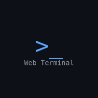

# Termdock

<p align="center">
  
</p>

**Bring your terminal and AI coding workspace to your phone, browser, and Mac.**

[](https://www.npmjs.com/package/termdock)
[](https://www.npmjs.com/package/termdock)
[](https://github.com/Jovines/termdock/releases)
[](LICENSE)

[简体中文](README.md) · English

Termdock is a self-hosted web terminal and AI Agent workspace. Run Claude Code, Codex, Gemini CLI, or your usual shell tools on your computer, then reconnect to the same tmux session from your phone. Connect multiple machines, exchange messages between Agent sessions, review changes, and inspect files from one workspace.

Commands run on the machine hosting the Termdock service. The browser, PWA, and macOS app connect to that service. Install and authenticate your preferred AI CLI separately on the service machine; model accounts and usage charges belong to the respective providers.

[Quick start](#quick-start) · [Features](#features) · [AI and collaboration](#ai-and-collaboration) · [FAQ](#faq) · [Documentation](#documentation) · [Contributing](#contributing)

## Why Termdock

- **Continue away from your desk.** Read output, send instructions, and answer Agent questions from your phone. tmux sessions keep running when you close the client.
- **Use a terminal designed for touch.** Customizable shortcut bars, touch scrolling, session swiping, and iOS keyboard adjustments make terminal interaction easier on small screens.
- **Keep AI work together.** Manage multiple Agent sessions and use collaboration groups for goals, questions, reviews, and acceptance.
- **Reach multiple machines.** Switch service workspaces or use a configured entry service to relay encrypted traffic. Each target verifies its own identity and permissions.
- **Inspect the actual results.** Browse files, review Git diffs, preview documents and media, and reference selected content in an Agent conversation.

## Quick start

### Requirements

| Component | Requirement |
| --- | --- |
| Service host | macOS or Linux; Windows users can try a Linux environment under WSL2 |
| Runtime | **Node.js 22+** and npm |
| Persistent sessions | `tmux` available in `PATH` |
| Web client | A current Chrome, Edge, Firefox, or Safari; use HTTPS for phone access and PWA installation |
| macOS app | The current packaging target is Apple Silicon / arm64; see [Releases](https://github.com/Jovines/termdock/releases) |

Installation checks native terminal dependencies and tmux and attempts repairs when needed. To prepare tmux manually:

```bash
# macOS with Homebrew
brew install tmux

# Ubuntu / Debian
sudo apt-get update
sudo apt-get install -y tmux
```

If `node-pty` needs compilation, install Xcode Command Line Tools on macOS (`xcode-select --install`), or `build-essential` and `python3` on Ubuntu / Debian. Behavior on WSL2, other Linux distributions, and mobile devices depends on the actual environment.

### Install and launch

```bash
npm install -g termdock

# Set a password before starting the service
td --set-password
td

# Find the actual URLs and service status
td --status
```

`td` and `termdock` are aliases for the same CLI. First launch may guide you through a local hostname and HTTPS setup. Open the URL printed in the startup log or `td --status`, sign in, and create a terminal.

For a local-only trial:

```bash
npx termdock --host 127.0.0.1
```

Without certificates, the local URL is `http://localhost:9834`. With certificates, use the HTTPS URL reported by the CLI. The default listener is `0.0.0.0:9834`; background mode uses a supervisor to recover from service crashes.

### macOS app

Download the DMG from [GitHub Releases](https://github.com/Jovines/termdock/releases). The connection center connects to independently running local, LAN, or public Termdock services.

When Node.js 22+ and the CLI are available, the app detects and starts the local service as needed. When the CLI is missing, **安装并启动** installs it into `~/.termdock/cli`. If Node.js is missing or outdated, the connection center offers its official download page. Quitting the app leaves the standalone service running.

The app adds native windows, shortcuts, Finder file interactions, and application updates. See the [macOS guide](docs/macos-desktop.md) for build, signing, and upgrade details.

### Phone access and HTTPS

```bash
td --set-password
td --setup-local-https
td
td --status
```

The HTTPS setup checks mkcert; on macOS it can install mkcert through Homebrew. You can also supply your own certificate and key with `--https-cert` and `--https-key`.

On the same reachable network, open the onboarding URL printed by the service, install and trust its local CA, then open the reported HTTPS URL:

```text
https://<name>.termdock.local:9834
```

On iPhone, use Safari's **Share → Add to Home Screen**. On Android, use the browser's app installation action. mDNS may be blocked by guest Wi-Fi, client isolation, or a VPN. An alternative hostname or IP address must also be covered by the certificate.

## Features

| Area | Capabilities |
| --- | --- |
| Terminal | xterm.js with WebGL rendering, tmux persistence, reconnect, mouse input, multiple sessions and saved layouts |
| Mobile | Touch scrolling, session swiping, pinch-to-resize text, configurable Esc / Tab / Ctrl / Alt / arrow shortcut bars |
| AI sessions | Built-in recognition and resume adapters for multiple Agent CLIs; extensible through plugins |
| Collaboration | Groups, messages, goals and subtasks, questions, plans, independent reviews, and explicit acceptance |
| Files and review | File browser, upload/download, clipboard images, drag and drop, Git diffs, contextual references |
| Architecture | Native project maps with nested modules, perspectives, source-line navigation, zoom and SVG export |
| Previews | Markdown, images, video, sandboxed HTML, STL / GLB / glTF, and KiCad files; some conversions require additional host tools |
| Connected devices | RDP/VNC desktop control; Android mirroring with adb, scrcpy, and an authorized device |
| Clients | Browser, installable PWA, and macOS desktop app; English and Chinese UI; Flexoki dark and light themes |
| Access | OPAQUE password authorization, Noise encrypted transport, device invitations, revocation, and configured encrypted relays |

Desktop control supports RDP and VNC. Ubuntu/Linux and Windows default to RDP; macOS defaults to built-in VNC Screen Sharing. RDP requires a local `guacd` backend on the Termdock service computer, bound only to `127.0.0.1:4822`. Enter the target’s Remote Desktop credentials and port (usually 3389; Ubuntu Desktop Sharing may use 3390). Credentials travel through the encrypted Termdock channel and are never stored or placed in URLs. VNC uses port 5900; keep the service-to-VNC connection on a trusted LAN or VPN. See the [desktop-control instructions](README.md#电脑控制) for setup.

PWA caching lets you reopen the cached interface offline. Terminal input, file access, and device control still need a working service connection. Phones may pause background clients; tmux continues on the service host.

## AI and collaboration

Open an Agent in your project terminal, then select **Map → Generate** in the right sidebar. Review the built-in analysis prompt, insert it into the current input or context draft, and send it to the Agent. Choose the entire project, selected directories/modules (multiple relative paths), or a feature flow across directories. Optional controls set dependency depth, starting paths and focus; large projects do not need a full overview first. The overview uses `.termdock/architecture.json`; scoped maps are saved independently under `.termdock/architectures/`. Switch with **Saved analyses**. **Update** targets only the selected map; **Analyze this module in detail** prepares its source paths directly. The panel checks for saved changes every 10 seconds while visible and offers manual refresh. Analysis uses the current Agent's time and allowance. Maps and source files use the selected service's encrypted transport, including remote projects reached through an entry relay. On phones, module cards open a separate reading panel that preserves list position. Selecting a fullscreen graph node shows a compact two-line preview on phones; open or collapse its details explicitly. Desktop uses a side inspector. Reading panes reserve space for the canvas, preserve zoom, and keep the selected node visible. Follow related modules and step back through them; preview source at its referenced line within the map, then return to the module in one action. Switch perspectives and explore submodules without leaving fullscreen. Diagrams also support drag-to-pan and pinch-to-zoom, with readable labels by default. Long analysis notes, path lists and limitations are kept in collapsible sections.

### Use your preferred CLI

Install and sign in to an Agent CLI on the service host, then launch it inside a Termdock terminal, for example `claude`, `codex`, or `gemini`. You can continue using the same terminal from another client. Ordinary shell programs such as Vim and htop also work.

### Collaborate across sessions and machines

Create a collaboration group and add Agent sessions. Use its workspace to send messages, create goals, answer questions, review deliverables, and accept results. Automatic collaboration supports a coordinator, separate execution directories, and independent review.

Inside a Termdock-managed terminal:

```bash
td collab --help
td collab status
td collab send <recipient-session-id> 'Please review the changes and reply with your findings'
td collab inbox --json
```

Collaboration relies on terminal delivery and explicit replies rather than provider-specific hooks. After service identity registration, cross-service delivery and retries run in the service background without an open browser. **Written to a terminal does not mean read by an Agent or completed.** Reports retain their original text and timestamps; outcomes require explicit review or acceptance.

See the [collaboration guide](docs/collaboration.md) and [encrypted access and relay guide](src/server/federation/README.md) for permissions, setup, and protocol limits.

### Progress reminders and scheduled prompts

```bash
td notify 'Tests passed; ready for review' --title 'Milestone'
td automation create --name 'Review current work' --every 30 --self \
  --prompt 'Review the current work and report what needs attention'
td automation list
td automation pause <automation-id>
td automation --help
```

`td n` is the short alias for `td notify`. Progress reminders require a connected Termdock page and are not stored offline. Existing-session scheduled prompts require an Agent running when the schedule fires. Schedules use the service timezone and run while the service is running; successful dispatch is not proof of task completion.

### Agent plugins

A plugin repository contains a root `manifest.json` and may include icons or helper scripts:

```bash
td plugin-install https://github.com/owner/my-agent-termdock-plugin
td plugin-list --json
td plugin-doctor my-agent --json
td plugin-update my-agent
td plugin-remove my-agent
td agent-plugin --json
```

Install only repositories you trust. Plugin installation and Agent hook installation have separate lifecycles; installing a plugin does not automatically install hooks. The [Chinese README](README.md#分享和安装-agent-插件) includes manifest examples and model selection rules.

## Service management and configuration

```bash
td --status              # Inspect the background service
td --stop                # Stop the supervisor and service
td --restart             # Restart a supervised service
td --foreground          # Run in the foreground for diagnosis
td update                # Update the globally installed CLI
td --help                # Full CLI reference
```

The CLI also checks for updates in the background. Installing an update does not automatically restart the running service; apply it through the explicit restart action. macOS app updates are separate from service updates.

Configuration examples live in [.env.example](.env.example); configuration loading, timeouts, supervision, and public access are documented in the [configuration guide](docs/configuration.md).

State lives under `~/.termdock`, including `auth.json`, `server.json`, `server.log`, `crash.log`, certificates, and federation identity and authorization data. Treat this directory as private.

The terminal has the permissions of the system account running the service. Public access requires a strong password, trusted HTTPS, and a correctly configured `TERMDOCK_PUBLIC_ORIGIN`; see [public access configuration](docs/configuration.md#公网安全模式). Application authentication and path checks do not provide multi-tenant OS isolation. A PWA still requires a trusted frontend code source.

## Development

```bash
git clone https://github.com/Jovines/termdock.git
cd termdock
npm install
npm run dev
```

Open `http://localhost:9833`. Vite proxies API and WebSocket connections to the development backend on port 9835; the installed service uses port 9834.

```bash
npm run lint             # TypeScript checking
npm test -- --run        # One test run
npm run build           # Build web client and server
```

Build output lives in `dist/client/` and `dist/server/`. Start built output with `npm start`. To build and install the CLI globally from source, use `./install-local.sh`; it also rebuilds `node-pty`. See [CONTRIBUTING.md](CONTRIBUTING.md) for review and verification expectations.

The stack includes React, TypeScript, Vite, xterm.js, Zustand, Tailwind CSS, Express, ws, node-pty, tmux, and Electron for the macOS shell.

## FAQ

**Which URL should I open on my phone?** Use the reachable HTTPS URL from `td --status`. `localhost` on your phone refers to the phone itself. Complete CA trust through the onboarding page first.

**Will closing the client stop my work?** Not in tmux mode. Destroying a session, killing its process, or shutting down the host does stop it.

**Why does terminal creation fail?** Check `node --version`, `tmux -V`, `td --status`, and `~/.termdock/server.log`. Common causes are an old Node.js runtime, missing tmux, or a failed native `node-pty` installation.

**Why do I still see the old UI after updating?** Restart the service after the CLI update, accept the page update, and reload. If the phone PWA retains older resources, fully close and reopen it.

**Which browsers are supported?** Use current Chrome, Edge, Firefox, or Safari. Clipboard, WebGL, background behavior, and PWA installation vary by platform. Browser emulation does not replace physical macOS / iOS verification; see the [known macOS beta issue](docs/macos-27-local-network.md).

## Documentation

Some detailed guides are currently in Chinese.

| Guide | Contents |
| --- | --- |
| [Chinese README](README.md) | Extended setup and CLI examples |
| [Configuration](docs/configuration.md) | Environment variables, supervision, public access |
| [macOS app](docs/macos-desktop.md) | Local service assistance, shortcuts, packaging and updates |
| [Collaboration](docs/collaboration.md) | Messages, cross-service delivery, tasks, reviews and acceptance |
| [Encrypted access and relays](src/server/federation/README.md) | Password proof, device authorization, routing and preview limits |
| [Electronics preview](docs/electronics-preview.md) | KiCad tools and position references |
| [Model features](docs/model-features.md) | 3D feature and coordinate references |

## Contributing

Bug reports, feature discussions, translations, device feedback, Agent plugins, and pull requests are welcome. English and Chinese are both welcome. Start with [CONTRIBUTING.md](CONTRIBUTING.md), [Issues](https://github.com/Jovines/termdock/issues), or [Pull Requests](https://github.com/Jovines/termdock/pulls).

If Termdock helps your workflow, consider starring the repository or sharing it with someone who needs a mobile terminal or self-hosted AI workspace. Remove passwords, invitation links, keys, and private paths before sharing logs or screenshots.

## License and acknowledgments

Termdock uses the [MIT License](LICENSE). Bundled dependencies and fonts retain their own licenses; see [third-party notices](public/third-party-notices.txt).

Thanks to [xterm.js](https://github.com/xtermjs/xterm.js), [tmux](https://github.com/tmux/tmux), [node-pty](https://github.com/microsoft/node-pty), [noVNC](https://github.com/novnc/noVNC), and the other open-source projects that make Termdock possible. The interface uses [Flexoki](https://stephango.com/flexoki).

<details>
<summary>Project naming note</summary>

Termcove is a tentative future name. The application, npm package, and CLI currently remain Termdock / `termdock`; no migration is needed.

</details>
