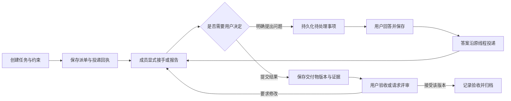

# Todos 协作机制研究与 Termdock 改造方案

Termdock 适合在现有终端协作之上增加持久化任务、用户收件箱和交付物审查，让用户围绕目标与需要处理的事项协作。首期应先补齐用户消息的回复闭环，再组织任务界面；后续加入协调者恢复上下文、独立评审与可选工作区隔离。

研究日期：2026 年 10 月 8 日。Termdock 源码基线：`2d243d7`。以下区分 Todos 官方说明、公开演示中的交互和 Termdock 的设计建议。Todos 登录后的实际调度、故障恢复与执行质量尚未验证；Termdock 的初始差距判断来自静态代码，尚未通过桌面或手机操作验证。初次研究阶段未修改产品代码；后续实现记录见文末，以下分阶段建议保留为研究历史。

## Todos 的协作流程

### 任务承载完整工作过程

Todos 的主要对象是任务 Todo，包含描述、负责人、执行 Agent 和多轮运行。运行产生的对话、计划、代码变更和分支关联在任务上；同一任务失败后可以开启新一轮，旧记录保留。[对象定义](https://todos.dev/docs/concepts)

这对 Termdock 的启发是让任务身份独立于终端会话。用户能重新分派同一目标，更换会话后仍找到之前的要求、提问、结果和验收记录。一个终端可以执行多个任务；一个任务也可能经过不同终端的多次尝试。

### 人工介入有明确对象

Todos 的任务可以先写计划，在 Confirm 等待用户确认，再实施并在 Review 等待接受。输入框内的文字作为反馈处理，确认与接受由专用动作触发；用户也可以选择直接实施。[任务阶段](https://todos.dev/docs/todos)

它把问题、计划、结果与失败集中到 Needs you，并通过通知触达任务所有者。问题有建议选项和自由输入，过时的问题可以显示为不再需要回答。[用户收件箱](https://todos.dev/docs/inbox)

Termdock 可以采用同样的对象关联：每个问题绑定任务和当前尝试，回答回到原线程。默认沿用用户已有授权；只有明确约定需要确认的计划、无法继续的必要问题及结果验收进入待处理，避免每个步骤都停下来。

### 协调者依赖可查询记录

Todos 每个团队有一个 Chief。它组织和分派工作，通过任务板、对话、成员与机器记录查询现状，并使用增量读取减少重复上下文。Chief 自己不写代码。[Chief](https://todos.dev/docs/chief)

Termdock 的协调者可以是用户指定的普通终端成员。重要能力是恢复分工、查询最新明确上报、处理依赖与追踪交付物。是否同时参与实现，由群协作约定决定。一个组不必强制使用协调者。

### 交付物不随聊天滚走

Todos 把计划和变更保存为有版本的文档；任务有运行历史，历史计划和 diff 可以重新打开。文档过大时会提示，避免静默截断。[计划与变更](https://todos.dev/docs/plans-and-diffs)

其独立评审在计划或变更等待用户处理时启动。评审者读取对应内容，意见写回原任务，执行者继续修订，最后仍由用户决定。[AI review](https://todos.dev/docs/ai-review)

Termdock 应建立“交付物版本—评审意见—修改结果”的关联。评审必须指向明确版本；旧版本的认可不能证明新版本通过。终端里称为“评审员”的角色描述本身不能强制工具只读。

### 规则与任务事实分别持久化

Todos 将用户编写的 Charter、Agent 的 Memory 和平台保存的任务记录分开；任务事实按需查询，长期规则和记忆注入后续上下文。[上下文与持久化](https://todos.dev/docs/context)

Memory 有作用域、条数限制、修改与过期机制，避免无限积累。Agent 各自保留经验，共享方法通过 Skills 传递。[Memory](https://todos.dev/docs/memory)

Termdock 已有群规和角色，优先增加任务上下文查询。长期约定、某个任务的决策、Agent 私人经验应分别保存。终端注入群规不能保证任意 Agent 在每一轮都重新读取；恢复工作时应有明确的上下文入口。

### 不同运行时提供不同保证

Todos 的外部运行时直接驱动用户已安装的 CLI，例如通过 `codex app-server`、Claude Agent SDK 或 ACP，再附加平台指令和 MCP 工具。个人配置的继承方式因运行时而异；外部运行时的权限、会话和 Skills 支持也有差异。[外部运行时](https://todos.dev/docs/runtimes)

Todos 的远程 MCP 提供任务读取、创建、运行和评审等能力，工具权限绑定 API key。[MCP](https://todos.dev/docs/mcp)

Termdock 保留 CLI 经本机服务通信的方式即可提供任务协作。未来可把同一套领域操作包装成 MCP，但不需要为了任务看板立即接管各家模型循环，也不能承诺可靠观测内部工具或恢复完整 Agent 对话。

### 公开演示中的界面组织

首页公开演示中，桌面把协调者对话与四列看板放在一起，并支持隐藏对话；390 × 844 的窄屏通过 Kanban 按钮切换看板层。新任务表单提供目标、现状、约束、完成标准和交付物的内容提示。[公开演示](https://todos.dev/)

适合借鉴的交互是任务与对话互相引用、任务详情有固定位置、窄屏切换视图，以及轻量的任务描述模板。演示的动态卡片数量和预设对话属于展示内容，不能作为真实执行能力的证据。

## Termdock 已有能力与主要差距

现有服务端已经承担后台投递、重试、跨服务通信和回执同步。新功能可以复用这些能力，不需要重新建立消息系统。仓库的[协作协议](collaboration.md)和[既有协作决定](../specs/多人协作反馈评估/doc/多人协作反馈评估与讨论.lark.md)仍是行为边界。

| 领域 | 当前源码证据 | 体验影响 | 建议 |
| --- | --- | --- | --- |
| 消息传输 | 后台投递、回执、幂等、重试诊断和固定终端路由已经存在 | 有可靠的派单基础 | 沿用消息 ID 和传输回执 |
| 用户回复 | 网页编辑器以用户身份发送；CLI reply 遇到原发送者为空会拒绝 | 用户发出的问题无法通过现有关联 reply 完成闭环 | 增加持久化用户回复目的地 |
| 任务身份 | TaskEnvelope 出现在接收方的显式回复中，派单不携带任务状态 | 任务定义与接手后的上报之间缺少稳定关联 | 派单创建任务引用，上报关联尝试 |
| 线程 | 消息已有 threadId 和 replyTo；页面按时间展示并合并广播 | 用户需要在流水中自行拼接上下文 | 任务详情内展示线程和回复链 |
| 结果与证据 | 页面有回复类型筛选，任务信息主要以 JSON 展开 | 结果难以快速审阅，缺少版本关联 | 显示结果摘要、证据与原始报告 |
| 历史 | 页面默认取最近 200 条；持久化会裁剪未受保护的历史终态消息 | 不能据有限消息窗口重建长期任务 | 任务及关键事件独立保留，消息支持分页 |
| 待处理 | 已看记录保存在浏览器 localStorage | 不是跨设备、持久化的工作收件箱 | 独立保存问题、回答与验收事件 |
| 提醒 | progressRoutes 对连接中的页面广播，无页面时明确返回提醒未保存 | 用户不在线时没有这类提醒的持久记录 | 先保存待处理事项，再通知 |
| 协调者 | 有群角色和群规，无独立任务分工记录 | 切换协调会话后需要重新拼接派单与回复 | 查询任务现状及增量变更 |
| 工作区 | 协作 spawn 接受工作目录，所读路径未创建独立 worktree | 创建 Agent 不保证文件改动隔离 | 显式选择共享目录或独立 worktree |
| 自动任务 | success 在投递流程结束后写入，消息为“任务已投递” | 不能理解为目标任务执行完成 | 分开表示触发结果与任务报告 |

关键源码入口：

- [AgentOperationsPanel](../src/lib/components/sidebar/AgentOperationsPanel.tsx)：网页发送、最近记录轮询、草稿、记录筛选、广播合并与证据展示。
- [collaborationRoutes](../src/server/agent/collaborationRoutes.ts)：会话消息权限、关联回复、回执、分页与 `NO_REPLY_TARGET`。
- [collaborationStore](../src/server/agent/collaborationStore.ts)：消息、消费游标、显式任务报告、幂等与历史裁剪。
- [collaborationProtocol](../src/server/agent/collaborationProtocol.ts)：TaskEnvelope 校验；派单与应用报告的语义分离。
- [terminal 路由](../src/server/routes/terminal.ts)：网页消息路由、Agent 会话创建、自动任务投递。
- [progressRoutes](../src/server/notifications/progressRoutes.ts)：页面在线提醒及无客户端时的明确失败。
- [collaborationService](../src/server/agent/collaborationService.ts)与[PeerTransport](../src/server/agent/collaborationPeerTransport.ts)：后台目录、群同步、身份验证和双向加密 RPC。
- [终端 API](../src/lib/terminal/api.ts)：现有文件 diff、分支 diff 与提交 diff，可以复用为交付物审查入口。

## 建议的协作工作台

### 默认入口与布局

每个协作组打开后，顶部首先显示待你处理的事项数量，以及当前任务筛选。保留独立的“发消息”和“创建任务”入口：讨论可以发给全组，任务默认指定一个负责人，多个执行者通过子任务明确分工。可选的协调者单独配置。

桌面宽屏让终端与任务详情同时可见；工作台自身提供任务列表和详情两栏。现有小浮窗保留快速发消息与待处理提示，完整任务管理进入全屏工作台，避免在小浮窗里塞入四列看板和多个嵌套滚动区域。

手机默认打开待处理列表，进入单个事项后查看问题、证据并回答。任务、详情和终端逐级切换，保留返回位置与草稿。首屏预算是组名、待处理入口、任务筛选和主要操作；成员管理、群规及连接诊断放在次级入口。

| 视图 | 默认内容 | 用户的主要动作 |
| --- | --- | --- |
| 待你处理 | 必要问题、明确请求确认的计划、结果验收、需要介入的失败 | 回答、查看证据、接受、要求修改 |
| 任务列表 | 标题、负责人、最近明确报告、事项数量、传输异常 | 打开详情、分派、筛选、搜索 |
| 任务详情 | 原始目标、分工、当前尝试、回复线程、交付物与决策历史 | 发反馈、查看终端、重新分派 |
| 成员 | 定位、终端或服务可达性、关联任务、最后观测时间 | 打开终端、调整定位 |

任务状态应由应用事实组织。可以使用“待分派、已分派、待你处理、已归档”；另行显示“成员于 14:30 报告进行中”“成员报告完成，待验收”。没有显式报告时显示“尚无接手报告”，不根据输出动画、静默时长或会话在线推断工作状态。

### 一次任务的完整体验

用户创建“修复手机代码块横向溢出”，描述目标、约束和完成标准，然后指定负责人。服务保存任务与派单记录，页面显示真实投递阶段。负责人显式 ACK 后，任务详情出现接手报告。

负责人需要确认行为时，提交绑定该任务的结构化问题。用户在手机回答，回答先持久化，再作为同一线程的消息投递给负责人。页面分别显示“回答已保存”和“已写入终端”；写入终端不代表模型已采用答案。

负责人提交结果及证据，任务进入待验收。用户可以请求另一成员针对明确版本评审，再要求修改或接受结果。接受记录本次交付物版本；合并代码、部署和终止会话是各自独立的操作，沿用现有授权规则。

## 数据与协议设计建议

### 任务和执行尝试独立保存

新增任务记录保存目标、约束、完成标准、负责人、协调者、所属组和可选父任务。一次分派或重新分派产生独立 Attempt，绑定派单消息、线程、成员、工作目录与交付物。旧尝试的迟到回复只进入旧尝试，不能覆盖新负责人的现状。

| 对象 | 需要保存的内容 | 关键约束 |
| --- | --- | --- |
| Task | 稳定身份、所属组、权威服务、目标、约束、完成标准、责任者、修订版本 | 生命周期独立于终端和消息裁剪 |
| Attempt | 任务、分派版本、负责人、派单消息、线程、工作区引用 | 每次重新分派产生新身份 |
| TaskEvent | 创建、分派、原始上报、问题、回答、提交、验收、关闭 | 保存操作者、来源消息、原始时间与服务接收序号 |
| Decision | 问题、选项、必要性、当前尝试、引用版本、回答与状态 | 过期或已回答的问题不能再次触发有效决策 |
| Artifact | 计划、结果、评审、证据引用、版本及来源服务 | 评审和验收绑定具体版本 |

用户关闭任务只改变任务管理状态。请求成员停止应另外发送消息，并显示真实回执；关闭、发送停止请求、终端被中断和进程已终止不能互相替代。

### 首先补齐用户回复目的地

用户不是终端会话。新增用户收件记录或类型明确的回复目的地，关联原用户派单和所在任务。Agent 对用户消息的 reply 可以写入这个持久目的地，服务不再要求原发送者必须是一个终端成员。

这类回复的事实是“用户收件记录已保存”，不能复用“已写入终端”的投递语义。远端 Agent 的回复通过已授权的协作连接返回任务权威服务，用户关闭页面后仍能到达并保存。

用户授权主体沿用当前服务的身份与权限体系。设备身份不自动等于同一个人；多个设备看到和处理同一事项需要符合既有管理授权。参与者只能报告自己有权参与的任务，不能凭 task ID 查阅其他组的数据，也不能冒充用户验收。

### 保持传输事实与应用报告分离

继续沿用现有入队、远端接收、终端写入和显式 ACK 语义。派单可附带任务引用与尝试 ID，不能借此设置“working”或“complete”。已有 TaskEnvelope 是成员的原始报告，新的任务视图显示来源、报告时间与原文。

`responseKind=result` 表示收到结果类型的回复，不保证成功；`task.status=complete` 表示成员自报完成，不保证用户已接受；无状态的自然语言回复只展示原文。百分比仅在成员明确提供时标为“成员上报”，不生成进度估算。

历史消息不通过“done”“完成”等关键词自动升级为任务。旧报告可以按组、来源成员、task_id 和回复链展示为历史报告；无法唯一关联时保留未关联记录，不能只凭相同 threadId 合并不同分工。

### 用户决策与答案投递分别可靠落盘

一个问题的回答使用修订版本检查和幂等键。用户双击、刷新重试或手机与电脑同时回答，只允许一次有效决策。后来的答案显示当前状态，不能静默覆盖已经提交的决定。

保存回答和安排投递需要原子写入或可恢复的持久 outbox。服务在保存后崩溃，重启仍能继续投递同一答案；投递失败时保留已保存的决定并显示重试状态。等待超时不会自动撤销用户答案或任务。

### 跨服务任务使用明确的权威来源

每个任务指定一个权威服务，其他节点保存副本和自己的原始报告。任务修改、分派、验收和关闭由权威服务验证版本后提交。引用以服务身份和本地对象 ID 组合，避免不同节点的同名 task_id 冲突。

权威服务给事件分配单调接收序号；同时保留源报告时间和来源服务。跨机时钟不能用于判断哪项决策有效。迟到、重复或乱序事件按事件身份去重，不依据终端消息状态的等级合并任务生命周期。

任务查询和报告仍走现有加密 fetch 与服务端 Noise RPC。协作授权只覆盖任务所需操作；增加任务能力不顺带开放远程文件系统、通用 HTTP 或凭据共享。旧服务缺少能力时明确提示不支持，不回退到直接 HTTP。

### 历史与增量读取

任务和决定的关键内容独立保留，引用消息清理后仍保存原始报告、时间与来源 ID。大正文有单独的获取入口与明确保留策略。分页返回 has_more 和可继续读取的游标，不能将最近 200 条展示为完整历史。

协调者查询使用独立 consumer 和接收序号，查询不自动提交游标；处理并保存结果后再提交。历史有缺口时返回保留边界，并从任务现状重新同步。任务上下文包含目标、当前分派、最近明确报告、未解决问题、交付物与适用群规版本。

### 交付物和代码审查

首期允许结构化保存文字结果、计划和有类型的证据引用。后续复用现有文件、分支和提交 diff API，引用必须带所属服务、仓库、分支或 commit，打开时重新验证当前授权。

共享工作目录里的未提交 diff 可能包含多人的改动，不能自动称为“该任务的全部变更”。可绑定具体提交、明确的基准分支与 head，或经过用户确认的文件范围。远端路径只在对应已授权服务中解释，不能插入本机路径或假定本机可读。

工作区隔离作为创建任务时的可选方式。新 worktree 不会自动包含共享目录的未提交修改，创建前应说明起点与影响；不自动移动已有工作、不删除含改动的目录，也不因任务归档自动合并分支。

## 适合调整后借鉴的机制

| Todos 机制 | Termdock 的选择 | 原因 |
| --- | --- | --- |
| Chief 统一对话 | 可指定协调者，用户仍能直接联系任意成员 | 保留现有终端工作方式 |
| Confirm 与 Review | 按任务授权决定是否设置确认点，结果可显式验收 | 减少重复确认，接受结果不扩展授权 |
| 完整运行时事件 | 默认展示传输事实和明确报告 | 任意终端无法提供统一内部事件 |
| 独立 worktree | 可选并明确共享目录的范围 | 当前仓库允许多人共享 WIP |
| 自动修订的评审循环 | 引用版本，指定成员，明确反馈与继续条件 | 当前终端角色不能强制只读或证明已修订 |
| 定时重跑替换旧运行 | 默认不取消旧工作，选择跳过、等待或明确授权重启 | 终端任务不能安全地自动重置 |
| 会话 rewind | 先提供任务版本和尝试历史 | 终端快照不等于完整模型上下文，回滚文件也不能回滚外部副作用 |
| 云端保存执行记录 | 协作数据先保存在用户服务，按需授权访问 | 适配当前自管、多服务架构 |

Todos 的定时规则明确允许新一轮取消未结束的上一轮，同时保留下一次计划与结果记录。[Schedules](https://todos.dev/docs/schedules) Termdock 应把每次触发关联到独立尝试，并通过明确上报或用户关闭管理前一轮，不能依据自动任务的投递成功判断旧工作完成。

Todos 的机器调度基于它拥有的运行槽位和机器注册状态。[Machines](https://todos.dev/docs/machines) Termdock 初期让用户选择成员和服务；已有终端在线只能证明可达，不能作为自动分派的空闲容量。

Todos 的权限设计分为 Agent、机器、成员和 API key 的授权。[Permissions](https://todos.dev/docs/permissions) Termdock 需要在现有授权模型中区分任务读取、上报、分派与用户决策，但不为一期协作界面另建整个团队账户体系。

其隐私说明明确保存任务、对话、diff 等平台展示内容；本机执行不意味着协作内容全部只在本机。[数据范围](https://todos.dev/privacy) 因此借鉴界面和任务模型，并不要求把 Termdock 的服务或数据接入 Todos。

## 分阶段实施范围

### 第一期 任务和用户待处理闭环

一期拆成三个连续增量，形成可交付的完整流程。投入主要在持久化、身份与关联回复，单独增加看板不能解决这些问题。

| 增量 | 范围 | 完成标准 |
| --- | --- | --- |
| A 持久记录与回复 | Task、Attempt、用户回复目的地、基本查询、CLI 关联报告、幂等派单 | 用户发出的任务可以被明确回复，重启后记录保留 |
| B 任务详情与待处理 | 任务列表、原始线程、问题与回答、结果证据、分页、桌面和手机布局 | 用户能从一个入口查看和回答事项，回复保持原线程关联 |
| C 验收与通知 | 交付物版本、要求修改、接受结果、持久待处理计数、现有通知通道接入 | 完成报告与用户验收分开，关闭页面后事项仍保存 |

优先改动位置是 server/agent 下新增任务领域存储与路由，现有 collaborationRoutes 的回复目的地分流，以及 terminal/api 的类型和请求。前端从 AgentOperationsPanel 抽出任务列表、详情和待处理组件，保留当前纯消息模式与旧服务兼容。

一期不把看板动作变成自动 git 合并，不通过关闭任务终止会话，不新增必须适配各家 Agent 内部事件的依赖。跨服务用户回复必须覆盖已有直连和入口中转，否则不能把一期称为完整协作闭环。

### 第二期 协调者和团队上下文

持久化协调者选择、任务依赖和分工，提供任务现状、上下文包与增量事件查询。协调者可以在压缩或换会话后恢复跟进；汇报带来源记录，未知情况明确保留为未知。

后续增加针对已订阅任务的事件汇总：结果、明确问题和失败发生时保存跟进事项，再按配置通知协调者。不要为每条终端输出唤醒模型。接手新任务、自动创建会话或重新分派仍需满足用户授权及组约定。

### 第三期 交付物评审和可选工作区

增加 commit 或分支级变更审查、独立评审分派、评审版本关系与再次提交。创建 Agent 时可选 worktree，并记录仓库、基准、分支和负责服务。共享目录继续可用，但证据范围明确显示。

### 第四期 自动化和可选运行时适配

自动任务复用 Task 与 Attempt，增加时区、单次触发、上一轮处理策略和漏触发策略；触发结果与业务结果分别展示。基于同一任务 API 提供可选 MCP 工具。确有用户需求时，再为特定原生运行时加入可验证的能力，界面区分这些能力的来源与适用范围。

## 完成标准与后续验证

用户体验指标应围绕具体动作：打开组后能找到待处理事项；回答无需复制任务或会话 ID；返回任务能看到原要求和最近明确报告；结果能追到对应证据；换设备或重启后能继续处理同一事项。后续体验验证记录操作步骤和实际耗时，不预先声称减少了多少百分比。

用户明确授权测试后，需要覆盖以下关键路径：

1. 用户派单、Agent ACK、必要问题、用户回答、结果提交和接受；关闭页面与服务重启后仍可继续。
2. 双击发送、未知发送结果后重试、双设备同时回答、过期问题、旧尝试迟到结果；不重复派单、不覆盖有效决策。
3. 直连及只能经入口中转的成员，离线、重连、旧服务能力不足；回答不丢失、不扩大授权、不绕过加密。
4. 超过消息展示窗口、历史裁剪、远端时钟偏差及乱序；分页、报告来源和任务现状仍准确。
5. 手机软键盘、返回位置、草稿、桌面终端与详情并列、浮窗与全屏切换；主要动作可达且没有重复入口。
6. 共享目录的他人 WIP、评审版本变化、worktree 创建起点、验收与合并分离；不把团队改动错误归属给一个任务。

改动 src 后按仓库规则执行构建、正式端口部署及 health 检查。功能测试和实机验收遵循用户的显式授权；源码完成、构建成功与协作体验验收分别记录。

建议首先实施一期 A 至 C，再根据实际使用反馈决定二期的协调者行为。它优先解决用户的追问、接收结果和跨设备决策成本，也为后续更深的协作提供稳定的数据基础。

## 本次实现记录

本次已实现核心任务闭环，以及协调者、任务依赖和独立评审的基础能力：

- 独立 Task / Attempt 持久化，原始报告、问题、用户回答、方案与结果版本及验收记录。
- `td collab task` 的创建、查询、报告、提问、分派、子任务、评审请求、评审及归档命令。
- 工作台「任务与决策」，待回答、待验收、显式受阻与投递失败筛选；窄屏列表/详情切换，本机草稿和未确认请求键保留。
- 回答与投递队列原子保存，消息沿现有加密服务通道投递；任务关联的用户消息可被 CLI 回复到任务。
- 单来源服务写入决策，其他节点保存副本；父任务与子任务归属同一来源，变更版本冲突明确拒绝。
- 协调者收到上下文，以及原始报告、问题、方案、评审与用户决定的持久通知；任务上下文复制和单任务记录导出。
- 列表只返回摘要，后台先同步版本目录再拉取变化记录；待投递消息保留错误原因并持续重试，不因页面关闭停止。

实现采用仓库现有权限、加密通信、Flexoki 配色和浮层规则。没有新增自动停止终端、自动合并代码、已读状态或推测的 Agent 忙闲状态。任务存储和 CLI/API 细节见 [协作协议文档](collaboration.md)。

自动任务复用 Task/Attempt、系统通知渠道、结构化代码 diff 视图、MCP、独立项目记忆和分页事件订阅仍属于后续范围。独立 worktree 与已评审提交接续已在下述补充实现。本次不能宣称已经完整复现 Todos，也不能把工作台改动视为 Todos 真实运行行为的验证。

按仓库规则未执行单元、回归、浏览器交互或实机验收。已完成生产构建；全量前端 TypeScript 检查的剩余错误均在本次修改之外：`TermdockUpdateSettings.tsx:154`、`i18n/en.ts:738`、`i18n/zh.ts:738` 的既有翻译类型，以及 `VirtualDiffHunk.test.tsx:17`、`rightSidebarRepoGroupCollapse.test.ts:39`、`useSidebarStore.test.ts:628`、`server/utils/settings.test.ts:193` 的既有测试类型。没有修改这些文件。跨服务直连、中转、断线、双设备决策和手机软键盘等实际行为仍待用户明确授权后验收。

2026-10-08 已按 `termdock-deploy` 流程部署正式端口 9834：由项目 `dist/server/cli.js` 的 supervisor 启动服务，HTTPS `/health` 返回 `status=ok`，实际页面入口 `/assets/app-BLVcKKwT.js` 与构建产物一致。这些检查确认构建与部署，不能替代协作功能验收。

### 补充：目标驱动的协调流程

用户要求完成原目标后，补上服务端推进规则，而不再把任务记录能力当作整体效率优势。新目标指定协调者与执行模板，协调者通过 CLI 拆分任务；服务按明确报告安排独立评审、交回返工、接续依赖，并保存下一次协调通知。最终汇总必须等待子任务通过评审；代码目标另需集成交付通过评审。子任务的「评审通过」与用户最终验收分开记录和展示。

代码子任务自动创建独立 worktree 和持久 Agent 终端，固定已提交基线，保留原目录的未提交改动。依赖的已评审提交在独立集成目录合并；跨节点通过既有 Noise RPC 分片传递 Git bundle 并校验摘要。原分支、发布、成员进程和历史目录不会被这些推进规则自动清理。非代码目标可以关闭代码隔离。

组工作区默认从一个目标开始，子任务在目标中展开。侧栏集中展示必要问题、方案确认、异常和待验收结果，并直接跳转任务。暂停、继续、失败重试和未收到协调说明的事实提示均有记录；模型须明确报告，不能从终端输出推断读消息、内部工具状态或进度。

本次生产构建成功，正式服务 PID 1953284、supervisor PID 1953252；HTTPS health 返回 ok，页面入口 `/assets/app-Cg9_TzxO.js` 与构建一致。全量 TypeScript 检查仍有前述 8 处既有错误，本次修改文件没有报错。按用户仓库规则未运行任何功能或交互测试，跨节点提交接续、故障恢复、原生客户端与移动端的实际可用性尚未验收；不能把部署结果当作这些路径已经实测的证据。
